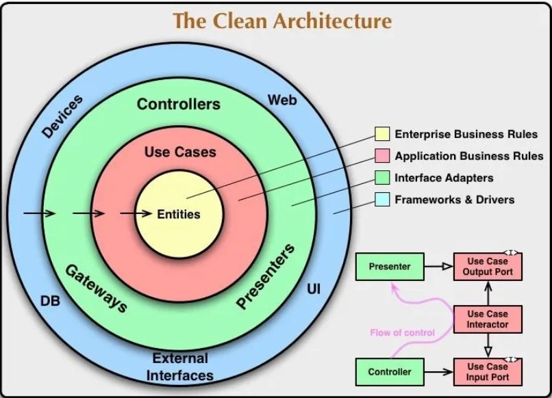
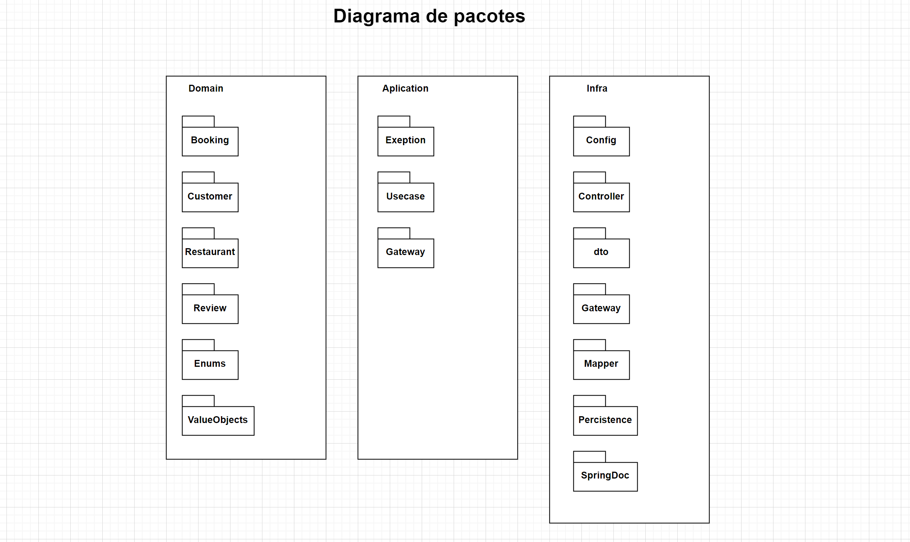

<div align="center">
<a href="https://www.fiap.com.br" target="_blank">
    
</a>

[](https://docs.oracle.com/en/java/javase/11)
[](https://docs.spring.io/spring-boot/docs/current/reference/htmlsingle)
</div>

# TRABALHO DE CONCLUSÃO - FASE 3 # - DEPLOY, ARQUITETURA E QUALIDADE DE SOFTWARE

## API de Gerenciamento de Restaurantes

----
Esta API permite a interação com um sistema de gerenciamento de restaurantes, fornecendo funcionalidades para criar,
atualizar, consultar informações relacionadas a restaurantes, reservas e avaliações. A API foi projetada para
atender tanto clientes quanto administradores.

### Funcionalidades Principais:

- **Cadastro de Restaurantes:**
    - O sistema permite cadastrar restaurantes, fornecendo informações como nome, localização, tipo de cozinha,
      horários de funcionamento e capacidade.
    - O sistema permite: buscar restaurantes por nome, cozinha e por CEP
    - Não é permitido criar restaurante com capacidade menor que 20 mesas
- **Reserva de Mesas:**
    - O sistema permite criar reservas para datas e horários específicos.
    - Não é possível criar reserva para um número de pessoa menor que 1
    - Administradores podem gerenciar reservas e visualizar as informações de disponibilidade.
    - Não é possível a criação de reservas fora do horário de funcionamento dos restaurantes
    - Não é possível criar uma reserva se a quantidade de mesas requeridas seja maior que a capacidade do restaurante
- **Avaliações e Comentários:**
    - Os clientes podem adicionar avaliações dos restaurantes.
    - Avaliações incluem classificações de estrelas e comentários detalhados.
    - O sistema só permite avaliar o restaurante se o usuário fizer uma reserva e ter o status `FINESHED`, garantindo
      que ele frequentou o restaurante
- **Clientes:**
    - É possível criar um cliente contendo: Nome, email e telefone
    - É possível buscar um cliente pelo seu ID

### Links úteis
- Suagger: [Link](http://localhost:8080/swagger-ui/index.html) (OBS: A API precisa está rodando pra funcionar esse link)
- URL na Railway [URL da API para se usar o POSTMAN](https://restaurantmanagement-production-ff9d.up.railway.app)

----

## Para executar o projeto , siga os passos abaixo:

1. **Download do projeto no GitHub:**  Primeiro, faça o download do projeto a partir do repositório no GitHub. Você pode
   clonar o repositório usando o seguinte comando:

   ```shell
   $ git clone https://github.com/Kleuber7/RestaurantManagement.git
   ```
4. **Pré-requisitos:**  Antes de executar o projeto, certifique-se de ter instalado os seguintes componentes:
   ```shell  
   -   Maven (versão 3.x)
   -   Java 17
   -   PostgreSQL (versão 16.x)
    ```
5. **No diretório do projeto:**  Navegue até o diretório onde você clonou o projeto:
   ```shell
   cd RestaurantManagement
   ```
6. **Compilando e empacotando com o Maven:**  Execute o seguinte comando para compilar o projeto e gerar o arquivo JAR:
   ```shell
   mvn clean package
   ```
8. **Executando a aplicação:**  Agora, inicie a aplicação com o seguinte comando:
   ```shell
   java -jar target/RestaurantManagement-1.0-SNAPSHOT.jar
   ```

# Design Arquitetônico:

O projeto foi desenvolvido tendo como base os princípio de Clean architecture, visando fundamento da inverção de
dependências, que garante o desacloplamento dos framworks do mercado



### Diagrama de pacotes

Assim estão distribuidos os pacotes da aplicação:



### Diagrama de arquitetura aplicada ao projeto

----

# Qualidade de Software:

----

## Testes Unitários:

Testes Unitários:
Os testes unitários são responsáveis por validar o comportamento isolado de cada unidade do sistema, garantindo que cada
componente funcione conforme o esperado.

Para executar os testes unitários do projeto, siga os passos abaixo:

Compilar o projeto: Antes de rodar os testes, certifique-se de compilar o projeto com o comando:

```shell
mvn compile
 ```

Testes Unitários:
Os testes unitários garantem que cada unidade do código funcione corretamente de forma isolada.

- Para rodar os testes unitários, execute o comando:

```shell
make unit-test
 ```

## Testes Integrados e Inspeção de Código:

Testes de Integração:
Os testes de integração verificam a interação entre diferentes componentes do sistema.

- Para executar os testes de integração, utilize o comando:

```shell
make integration-test
 ```

## Testes de Integração no Controller, CI e BDD:

Testes de Sistema:
Esses testes garantem que o sistema como um todo esteja funcionando de maneira correta em um ambiente que simule o de
produção.

- Para executar os testes de sistema, utilize o seguinte comando:
- OBS: Para executar os testes de sistemas é preciso que a API esteja rodando

```shell
make system-test
 ```

## Testes Não Funcionais:

4. Testes de Performance:
   Os testes de performance avaliam o comportamento da aplicação sob diferentes níveis de carga.

- Para executar os testes de performance usando Gatling, utilize o comando:

```shell
make performance-test
 ```

## Executando todos os testes

- Se você deseja executar todas as categorias de testes (unitários, de integração e de sistema), pode utilizar o
  seguinte comando:

```shell
make test 
 ```

## Gerar relatórios de testes com Allure

Gerar relatório de testes.

- Para visualizar o resultado dos testes com o Allure, execute o comando abaixo. Isso gerará um gráfico e relatórios
  detalhados dos testes executados:
- OBS: É necessário ter o node instalado em seu host e depois instalar o pacote Allure com ``npm i allure``

```shell
allure serve target/allure-results
 ```

Estrutura do relatório: O relatório gerado pelo Allure fornece uma visão geral dos testes executados, incluindo métricas
como:

- Número de testes executados
- Testes aprovados, reprovados e com erro
- Tempo de execução de cada teste
- Gráfico de cobertura de testes
- Manutenção dos testes: Para garantir a qualidade contínua do código, é importante que os testes unitários sejam sempre
  executados após qualquer modificação no código.

## Medir cobertura de teste:

## Deploy:

### C) Participantes

- RM353873 - Kleuber Costa
- RM354111 - Felipe Oliveira
- RM354482 - Letícia Oliveira
- RM354525 - Marcello Caseiro
- RM355621 - Paulo Bof


